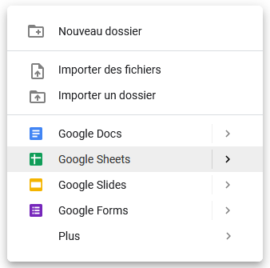
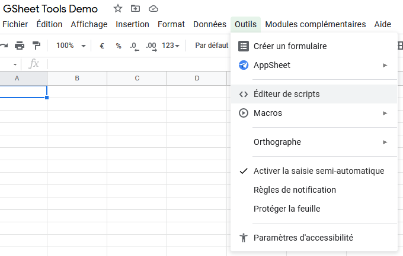
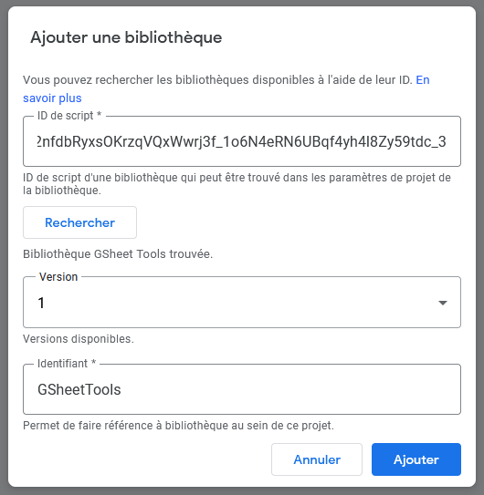
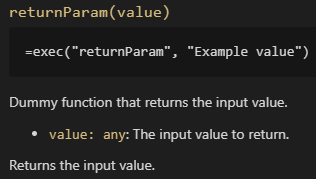

# GSheet Tools, tools for Google Spreadsheet

There's two ways of using a Spreadsheet:

- doing normal things as Spreadsheets are designed for, such as accounting, keeping a history of transactions, register products or use it as a database in some way, ...
- and doing fancy things that you might not have think of: task management, game design or a run of a game, simulating values like rolling a die or drawing a card, ...

Whatever the task you use Spreadsheets for, you might encounter limits with built-in functions. And here comes a big deal: the only way to extend the functions library is to create custom scripts

To do so in Google Spreadsheets, you have to use *Google Apps Scripts*, which allow you to create custom scripts using JavaScript. But you may not be a developer, and if you are, you may want not to reinvent the wheel. So here we are: this library is meant to make your life easier!

**This library adds functions to the build-in ones, provides helper function to create your own ones, and also provides custom interfaces to create new kind of controls like multi-selection dropdown, and more!**

## Getting Started

### How to add the library to your Google Spreadsheet file

1. Create a new Google Sheet file from GSheets or your GDrive (click on the *New* button, or right-click anywhere on the page)



2. In the *Tools* menu, click on *Scripts Editor*



Note that this is the editor that allow you to write your custom scripts.

3. Click on the *+* icon next to the *Library* menu


4. Write the ID of the GSheetTools file in the text field, click on *Search*, select the latest version, then click on *Add*

```txt
1rgc12nfdbRyxsOKrzqVQxWwrj3f_1o6N4eRN6UBqf4yh4l8Zy59tdc_3
```



Note that you can select a specific version, and edit it later. There's a "special" version though, `HEAD`, which is the "development" version. This version will constantly be synced with the version we're currently writing. This means you'll be constantly up to date, but keep in mind that the changes we do might alterate your document and cause errors (temporarily, don't worry) directly. We recommend you to **select the latest version** when you add the library for the first time, and **only check for an update when you want to use a function that is not in the version you're currently using**.

Also note that you can rename the `GSheetTools` reference before adding the library. Writing a shorter name makes it easier to use, but in this whole documentation, we assume that you kept the original name.

### Use GSheet Tools functions

Unfortunately, since the script is used as a library, you can't call its methods directly: this is meant to be used only into your own custom methods.

The problem here is that you'll be forced to copy the methods, with the same name, the appropriate number of parameters, and the same comments if you want the proper documentation.

But the goal here is to make your life easier, so **instead of writing copies of the methods, we suggest you to create one that will call all the others**.

Open the script editor, and write the following code:

```js
/**
 * Executes the named function from Muffin Dev's GSheet Tools library. You can pass an infinity of parameters to this method, as the function to call needs.
 * @param {string} functionName The name of the method to call from GSheet Tools library.
 * @param {...any} ...params The arguments to pass to the named method.
 * @customfunction
 */
function exec(functionName, ...params) {
  if(GSheetTools[functionName] === undefined) {
    throw new Error('The named method doesn\'t exist!');
  }
  return GSheetTools[functionName](...params);
}
```

Now, you can call the GSheet Tools methods directly by their names. The example of this documentation will show you the line to write in your spreadsheet cells to use this `exec()` method.

## Main features

- Text manipulation and formatting
- Random number generation and seeding

## Documentation

- [**Conversion**](./conversion.md): Functions for converting values
- [**Dummy**](./dummy.md): Few functions just meant to test if things work
- [**Random**](./random.md): Functions for working with randomization, also allow you to use seeds
- [**Validation**](./validation.md): Functions for validating data

***Bonus* : [Tips & Tricks handbook for Google Spreadsheet](./tips-and-tricks.md)**, which will be updated as we're writing the documentation.

### How to read this documentation?

In the links above, you will see that methods are documented using JavaScript terms and syntaxes (even those which are only meant to be used in your spreadsheet). These terms can be confusing for non-developers, so here is a little guide about those terms.

As an example, let's take the `returnParam()` function documentation, which you can find in *[Dummy methods](./dummy.md)*:



The title shows you the name of the function (here `returnParam()`), and the name of its eventual parameters (here `value`).

The code block under the title shows you the common usage of this function, using the `exec()` function written above, in the *Use GSheet Tools functions* section. This line can be copy-pasted as is in one of your GSheet file cell. Its just an example, so feel free to change the values between the parenthesis! If that code block does not appear, than the method is only meant to be used in your own custom functions, not directly in the spreadsheet.

The text under that block explains what the function does.

If the function has input parameters, each one are detailed. In this example, you can see `value: any`, followed by the purpose of that parameter. This syntax is mostly used in TypeScript (which is an overlay for JavaScript), and shows the expected value type of that parameter. The common types and symbols are:

- `any`: Means "anything", so you can pass a cell, a range, a string, a number, ... anything that makes sense for the method you're using
- `string`: Letter or text
- `number`: Well... a number. Note that it can be precised in the documentation if the method expects a decimal number or only an integer
- `boolean`: A value that represents a "yes" or a "no". "Yes" value are: `TRUE`, `"true"`, `"yes"`, `"y"` and `1`. Any other value is considered as a "no"
- `Column`: Represents a range of cells of only 1 column large
- `Row`: Represents a range of cells of only 1 row large
- `Range`: Represents a range of cells. By default, whatever the dimension. But the documentation may specify a number of rows or columns.
- `...`: This symbol represents an infinity of parameters. For example, if a function has a parameter `...number`, you can pass as many numbers you want as parameters to that method (just like the `SUM()` function does!)
- `|`: This symbol means "OR", and is meant to define several possible types for a single parameter. For example, `number|string` means that a parameter expects a number OR a text

At the bottom of the function documentation, you can find informations about the returned result (and so, about what the method should write in the cell it's used), and some example if the function is complex or has several use cases.

### Generated documentation

The following links leads to hand-written documentation redacted with patience and love. But you can read the generated documentation here: https://script.google.com/macros/library/d/1rgc12nfdbRyxsOKrzqVQxWwrj3f_1o6N4eRN6UBqf4yh4l8Zy59tdc_3/1 (replace `/1` at the end of this URL by the number of the version you want to read the generated docs).

## Support & Contact

Create a new issue on GitHub or contact us at contact@muffindev.com for any issue report, feature request or feedback you want to send! :)

## Support the project!

Did you find this content useful? The project is open source, but if you want to support my work, please consider buying me a coffee!

[](https://www.buymeacoffee.com/muffindev)