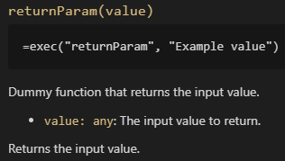

# GSheet Tools - Documentation summary

## Documentation

- [**Arrays**](./conversion.md): Functions for working with ranges and JavaScript arrays
- [**Conversion**](./conversion.md): Functions for converting values
- [**Dummy**](./dummy.md): Few functions just meant to test if things work
- [**Math**](./math.md): Math operations that are not in built-in library or doesn't exist in JavaScript's `Math` class
- [**Miscellaneous**](./miscellaneous.md): Useful functions that doesn't fit well in a category...
- [**Random**](./random.md): Functions for working with randomization, also allow you to use seeds
- [**Statistics**](./statistics.md): Functions for doing statistics
- [**Validation**](./validation.md): Functions for validating data

***Bonus* : [Tips & Tricks handbook for Google Spreadsheet](./tips-and-tricks.md)**, which will be updated as we're writing the documentation.

### How to read this documentation?

In the links above, you will see that methods are documented using JavaScript terms and syntaxes (even those which are only meant to be used in your spreadsheet). These terms can be confusing for non-developers, so here is a little guide about those terms.

As an example, let's take the `returnParam()` function documentation, which you can find in *[Dummy methods](./dummy.md)*:

The title shows you the name of the function (here `returnParam()`), and the name of its eventual parameters (here `value`).

The code block under the title shows you the common usage of this function, using the `exec()` function written above, in the *Use GSheet Tools functions* section. This line can be copy-pasted as is in one of your GSheet file cell. Its just an example, so feel free to change the values between the parenthesis! If that code block does not appear, than the method is only meant to be used in your own custom functions, not directly in the spreadsheet.

The text under that block explains what the function does.

If the function has input parameters, each one are detailed. In this example, you can see `value: any`, followed by the purpose of that parameter. This syntax is mostly used in TypeScript (which is an overlay for JavaScript), and shows the expected value type of that parameter. The common types and symbols are:

- `any`: Means "anything", so you can pass a cell, a range, a string, a number, ... anything that makes sense for the method you're using
- `string`: Letter or text
- `number`: Well... a number. Note that it can be precised in the documentation if the method expects a decimal number or only an integer
- `boolean`: A value that represents a "yes" or a "no". "Yes" value are: `TRUE`, `"true"`, `"yes"`, `"y"` and `1`. Any other value is considered as a "no"
- `...`: This symbol represents an infinity of parameters. For example, if a function has a parameter `...number`, you can pass as many numbers you want as parameters to that method (just like the `SUM()` function does!)
- `|`: This symbol means "OR", and is meant to define several possible types for a single parameter. For example, `number|string` means that a parameter expects a number OR a text

At the bottom of the function documentation, you can find informations about the returned result (and so, about what the method should write in the cell it's used), and some example if the function is complex or has several use cases.

### Generated documentation

The following links leads to hand-written documentation redacted with patience and love. But you can read the generated documentation here: https://script.google.com/macros/library/d/1rgc12nfdbRyxsOKrzqVQxWwrj3f_1o6N4eRN6UBqf4yh4l8Zy59tdc_3/1 (replace `/1` at the end of this URL by the number of the version you want to read the generated docs).

---

[< Back to main page](../README.md)