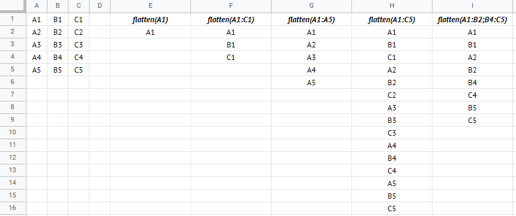
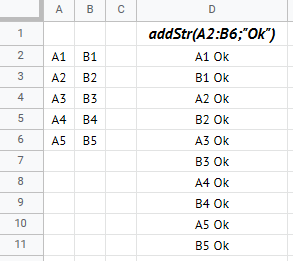

# GSheet Tools - Arrays

What we call "arrays" are ensembles of values. The functions below are usually meant to work with ranges, or can be helpers for working with *real* arrays in JavaScript for your own code.

Note that in GSheet, methods that returns arrays will be displayed as range inside the spreadsheet.

## Functions you can use in spreadsheet

### `flatten(...ranges)`

```txt
=exec("flatten";A1)
=exec("flatten";A1:C5)
=exec("flatten";A1:B2;B4:C5)
```

Groups the given cells into a single column. Note that this method already exists in the built-in library, but you can use this version for your own custom methods.

- `...ranges`: The cell, range or list of ranges to agregate.

Returns all the values as a 1D array.



## Methods to use only for your own custom functions

### `forEach(callback, ...ranges)`

Executes the given function on every value of the given ranges. This function also regroup all found values in an array.

- `callback: (value: any) => void|any`: The function to execute for each value. If this function returns a value, it replaces the value to put in the output array. If this function doesn't return a value, the output array will be the same as if you used `flatten()`.
- `...ranges`: The cell, range or list of range to process.

Returns an array that contains all the found values, or the return values of the given function.

#### Usage example

Copy this function into the script editor (`Tools > Script Editor`).

```js
/**
 * Adds a text after each input value.
 * @param {any|Range} range The value or range to process.
 * @param {string} str The text to add to the values.
 * @return Returns the transformed values as a 1D array.
 * @customfunction
 */
function addStr(range, str) {
  return GSheetTools.forEach((val) => val + str, range);
}
```



---

[< Back to summary](./README.md)