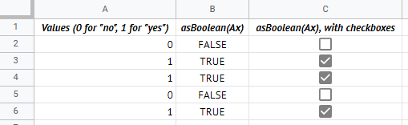
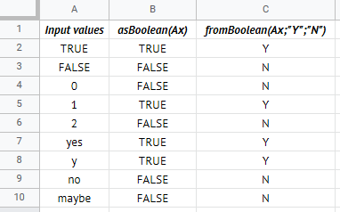

# GSheet Tools - Conversion

## Functions you can use in spreadsheet

### `asBoolean(value = null)`

```txt
=exec("asBoolean";"yes")
```

Converts the input value into a boolean. Values considered `true` (case-insensitive) are: `true`, `"y"`, `"yes"`, `"true"`, `"1"` and `1`.

- `value: any = null` (facultative): The value to convert. If the value is a method, it will try to convert the returned value of that method as a boolean.

Returns the converted value.

#### Example with checkboxes

This method can be useful if you're working with checkboxes in GSheet. As an example, if you have a range of data that contain 0 which mean "no" and 1 which mean "yes", you can use the `asBoolean()` method to convert them into `TRUE` and `FALSE` values, so you can display them as checkboxes.



Learn how to insert checkboxes in the [Tips & Tricks guide](./tips-and-tricks.md).

### `fromBoolean(value = null, trueValue = 1, falseValue = 0)`

```txt
=exec("fromBoolean";"TRUE")
=exec("fromBoolean";"TRUE";"Y":"N")
```

Converts the input value into another, depending if it's `true` or `false`. Values considered `true` (case-insensitive) are: `true`, `"y"`, `"yes"`, `"true"`, `"1"` and `1`.

- `value: any = null` (facultative): The value to convert. If the value is a method, it will try to convert the returned value of that method as a boolean.
- `trueValue: any = 1` (facultative): The output value if the input is `true`.
- `falseValue: any = 0` (facultative): The output value if the input is `false`.

Returns the converted value.



---

[< Back to summary](./README.md)