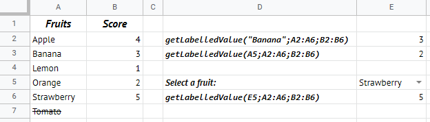

# GSheet Tools - Miscellaneous

## Functions you can use in spreadsheet

### `getLabelledValue(label, labels, values)`

```txt
=exec("getLabelledValue";"Banana";A1:A5;B1:B5)
```

Gets the value bound to the given label. In order to make it work correctly, the labels range and the values range must have the same length.

- `label: string`: The label of the value you want to get.
- `labels: string[]`: The range of all labels.
- `values: any[]`: The range of all values.

Returns the value bound to the given label.



---

[< Back to summary](./README.md)