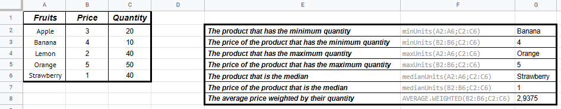

# GSheet Tools - Statistics

## Functions you can use in spreadsheet

### `minUnits(labels, units, include0 = false)`

```txt
=exec("minUnits";A1:A5;B1:B5)
=exec("minUnits";A1:A5;B1:B5;"yes")
```

Gets the label that has the minimum units.

- `labels: any[]`: The list of labels.
- `units: number[]`: The number of units of each label.
- `include0: boolean = false` (facultative): By default, 0 units is considered as an empty cell, and so that value is ignored. Set this parameter to `true` to include 0.

Returns the label that has the minimum units.



### `maxUnits(labels, units, include0 = false)`

```txt
=exec("maxUnits";A1:A5;B1:B5)
=exec("maxUnits";A1:A5;B1:B5;"yes")
```

Gets the label that has the maximum units.

- `labels: any[]`: The list of labels.
- `units: number[]`: The number of units of each label.
- `include0: boolean = false` (facultative): By default, 0 units is considered as an empty cell, and so that value is ignored. Set this parameter to `true` to include 0.

Returns the label that has the maximum units.


### `medianUnits(labels, units, descending = false, include0 = false)`

```txt
=exec("medianUnits";A1:A5;B1:B5)
=exec("medianUnits";A1:A5;B1:B5;"yes")
=exec("medianUnits";A1:A5;B1:B5;"no";"yes")
```

Gets the label bound to the median value of the units.

- `labels: any[]`: The list of labels.
- `units: number[]`: The number of units of each label.
- `descending: boolean = false` (facultative): By default, units and their bound labels are sorted by ascending orders. Set this parameter to `true` to sort them in descending order.
- `include0: boolean = false` (facultative): By default, 0 units is considered as an empty cell, and so that value is ignored. Set this parameter to `true` to include 0.

Returns the label bound to the median value of the units.


---

[< Back to summary](./README.md)