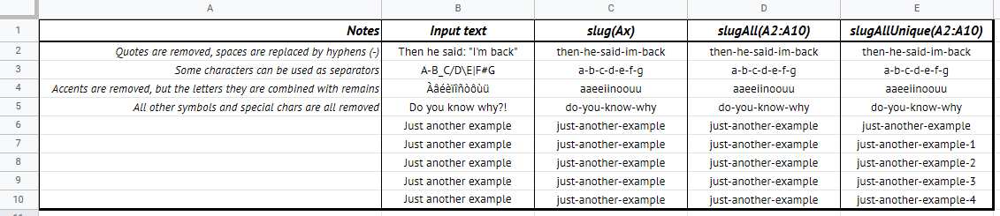

# GSheet Tools - Text

## Functions you can use in spreadsheet

### `function slug(text)`

```txt
=exec("slug";"I'd like quotes to be removed!")
=exec("slug";A1)
```

Converts a text into a URL-friendly slug. This can be useful to deal with data with quotes, which can cause issues with GSheet. You can also create unique yet readable ids, so you can use the spreadsheet as a content manager for a website.

- `text: string`: The input text to "slugify".

Returns the processed text.



### `slugAll(...ranges)`

```txt
=exec("slug";"I'd like quotes to be removed!";"And voilà!")
=exec("slug";A1)
=exec("slug";A1:A5;BA:B5)
```

Converts the data in the given range into slugs, as a 1D array.

- `ranges: any[]`: The cell or ranges of values to convert into slugs.

Returns a 1D array with the processed data.


### `slugAllUnique(...ranges)`

```txt
=exec("slugAll";"I'd like quotes to be removed!";"And voilà!";"And voilà!")
=exec("slugAll";A1)
=exec("slugAll";A1:A5;BA:B5)
```

Converts the data in the given range into unique slugs, as a 1D array. If several values ha the same slug, this function adds a *-X* suffix to it, where *X* is the number of occurencies.

- `ranges: any[]`: The cell or range of values to convert into unique slugs.

Returns a 1D array with the processed data.


## Methods to use only for your own custom functions

### `parseA1Notation(range)`

Extracts the informations from a given range with A1 notation (eg. "A1", "A1:C5", "Sheet!A1", "'Example Sheet'!A1:C5", ...).

- `range: string`: The range you want to parse (eg. "A1", "A1:C5", "Sheet!A1", "'Example Sheet'!A1:C5", ...).

If the input range is valid, it returns an object that summarizes the range. Otherwise, it returns null.

#### Ouput object format

```txt
{
  sheet: string|undefined - The name of the target sheet if given
  col1: string - The column letter of the first coordinate
  row1: number - The row number of the first coordinate
  col2: string|undefined - The column letter of the second coordinate if given
  row2: number|undefined - The row number of the second coordinate if given
}
```

#### Usage example

```js
/**
 * Gets the name of the target sheet of a given range.
 * @param {string} range
 * @returns {string}
 * @customfunction
 */
function getSheetName(range) {
  return GSheetTools.parseA1Notation(range).sheet;
}

// In a cell of your spreadsheet, use formula =getSheetName("'Sheet 1'!A1:C5") to get "Sheet 1"
```

---

[< Back to summary](./README.md)