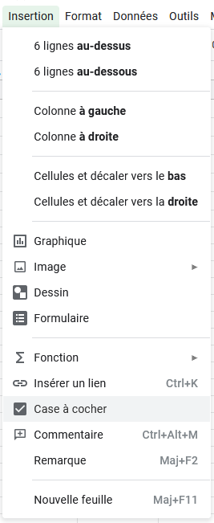

# GSheet Tools - Tipss and Tricks

This page is not a part of the documentation of the Muffin Dev's GSheet Tools library, but is just here to provide some useful tips for Google Spreadsheet.

## Checkboxes

You can use checkboxes to display `true` and `false` values properly.

You can use the [`asBoolean()` function](./conversion.md) of the library to convert your data into `TRUE` and `FALSE` values, so you can display them as checkboxes.